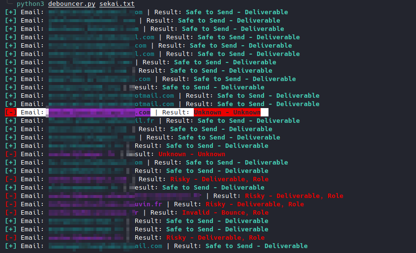

# Debouncer
Python code to debounce email.

You need to create account on [Debounce.io](https://app.debounce.io/) and create a api on their site.
Use **API KEY** in script.

Usage:
```sh
python3 debouncer.py [FILE]
```
OR
```sh
python3 debouncer.py [SINGLE EMAIL]
```


